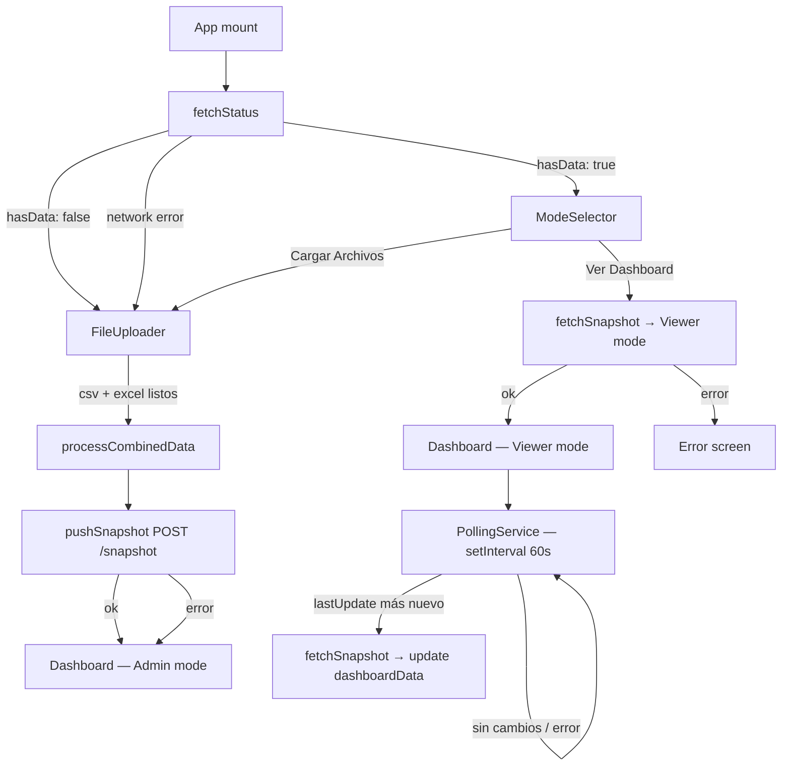

# Design Document — sync-front-back

## Overview

La feature conecta el front React con el backend Express ya existente, introduciendo dos modos de uso: **Admin** (sube archivos, procesa localmente y publica el snapshot) y **Viewer** (consume el snapshot del backend sin archivos). El flujo central es:

1. Al montar la App, se consulta `GET /status` para saber si hay datos en el servidor.
2. Si hay datos, se muestra el `ModeSelector`; si no, se va directo al `FileUploader`.
3. El Admin procesa los archivos con `processCombinedData` y llama `POST /snapshot`.
4. El Viewer llama `GET /data` y renderiza el dashboard con el objeto recibido.
5. Un `PollingService` en modo Viewer consulta `GET /status` cada 60 s y refresca si hay un snapshot más nuevo.

No se modifica el backend. Todos los cambios son en el front (`src/`).

---

## Architecture



### Separación de responsabilidades

| Capa | Responsabilidad |
|---|---|
| `api.js` | Comunicación HTTP (ya implementado, sin cambios) |
| `App.jsx` | Máquina de estados de la App (modo, datos, sync status) |
| `ModeSelector` | Componente nuevo — pantalla de selección de modo |
| `SyncStatus` | Componente nuevo — indicador de estado de push |
| `usePolling` | Hook nuevo — encapsula el intervalo de polling |
| `Header` | Modificado para recibir y mostrar `SyncStatus` y `lastUpdate` del Viewer |
| `Sidebar` | Modificado para ocultar "Cargar Datos" en modo Viewer |

---

## Components and Interfaces

### App.jsx — nuevo estado

```js
// Modos de la app
type AppMode = 'loading' | 'mode-selector' | 'file-uploader' | 'dashboard-admin' | 'dashboard-viewer' | 'error'

// Estado de sincronización (solo Admin)
type SyncState = 'idle' | 'syncing' | 'success' | 'error'

// Estado nuevo en App
const [appMode, setAppMode]         = useState('loading')
const [syncState, setSyncState]     = useState('idle')       // Admin
const [syncTime, setSyncTime]       = useState(null)         // ISO string
const [serverLastUpdate, setServerLastUpdate] = useState(null) // Viewer
const [dashboardData, setDashboardData] = useState(null)     // reemplaza el useMemo actual
```

El `dashboardData` deja de ser un `useMemo` derivado de `dataFiles` y pasa a ser estado directo, ya que en modo Viewer viene del servidor.

### ModeSelector (nuevo componente)

Props:
```ts
interface ModeSelectorProps {
  lastUpdate: string | null   // ISO string del último snapshot
  onViewDashboard: () => void
  onLoadFiles: () => void
}
```

Muestra la hora de `lastUpdate` formateada o "Sin datos previos" si es null.

### SyncStatus (nuevo componente)

Props:
```ts
interface SyncStatusProps {
  state: 'idle' | 'syncing' | 'success' | 'error'
  time: string | null   // ISO string de la última sync exitosa
}
```

Renderiza:
- `syncing` → spinner + "Sincronizando..."
- `success` → punto verde + hora en HH:MM
- `error` → punto rojo + "Error de sincronización"
- `idle` → nada

### usePolling (nuevo hook)

```ts
function usePolling(
  enabled: boolean,
  currentLastUpdate: string | null,
  onNewSnapshot: (data: object) => void,
  intervalMs?: number
): void
```

Internamente usa `useEffect` con `setInterval`. Limpia el intervalo en el cleanup del efecto. Lee `REACT_APP_POLL_INTERVAL_MS` del entorno con fallback a 60000.

### Header — cambios

Recibe dos props adicionales:
```ts
syncStatus?: SyncStatusProps   // solo Admin
viewerLastUpdate?: string | null  // solo Viewer (ISO string)
```

### Sidebar — cambios

Recibe prop adicional:
```ts
isViewer: boolean
```

Cuando `isViewer === true`, oculta el botón "Cargar Datos".

---

## Data Models

### Snapshot (dashboardData)

El objeto que circula entre front y back es el retorno de `processCombinedData`. Su forma es:

```ts
interface DashboardData {
  kpis: object            // KPIs del turno, incluye ultimaActualizacion (string)
  matrix: object          // Matriz de dársenas
  chartData: object[]     // Serie temporal de piezas
  vehiculosChartData: object[]
  targets: object
  tableData: object[]     // Tabla HU / CutOff
  totalesHU: object
  volData: object[]       // Voluminoso
  arrivalChasis: object[]
  superBiggerList: object[]
  superBiggerChartData: object[]
  huStats: object
}
```

El backend valida que el payload tenga la propiedad `kpis` antes de guardarlo (`uploadController.js`).

### fetchStatus response

```ts
interface StatusResponse {
  hasData: boolean
  lastUpdate: string | null   // ISO 8601
}
```

### pushSnapshot response

```ts
interface PushResponse {
  status: 'ok'
  lastUpdate: string   // ISO 8601
}
```

---

## Correctness Properties

*A property is a characteristic or behavior that should hold true across all valid executions of a system — essentially, a formal statement about what the system should do. Properties serve as the bridge between human-readable specifications and machine-verifiable correctness guarantees.*

### Property 1: Snapshot round-trip

*For any* `dashboardData` válido producido por `processCombinedData`, serializarlo con `JSON.stringify` y deserializarlo con `JSON.parse` debe producir un objeto estructuralmente equivalente (mismas claves de primer nivel, mismos valores primitivos).

**Validates: Requirements 2.5**

---

### Property 2: Estado inicial determinado por fetchStatus

*For any* respuesta de `fetchStatus`, el modo inicial de la App debe ser exactamente uno de: `mode-selector` (si `hasData: true`) o `file-uploader` (si `hasData: false` o error de red). Nunca puede quedar en `loading` después de recibir la respuesta.

**Validates: Requirements 1.1, 1.2, 1.3, 1.4**

---

### Property 3: Push exitoso implica SyncStatus success

*For any* llamada a `pushSnapshot` que retorne sin lanzar excepción, el `syncState` de la App debe ser `'success'` y `syncTime` debe ser un string ISO no nulo.

**Validates: Requirements 2.2, 6.2**

---

### Property 4: Push fallido implica SyncStatus error

*For any* llamada a `pushSnapshot` que lance una excepción, el `syncState` de la App debe ser `'error'` y el `dashboardData` debe seguir siendo el dato local procesado (no null).

**Validates: Requirements 2.3, 6.3**

---

### Property 5: Polling detecta snapshot más nuevo

*For any* par `(currentLastUpdate, statusLastUpdate)` donde `statusLastUpdate > currentLastUpdate` (comparación ISO), el PollingService debe invocar `fetchSnapshot` exactamente una vez por ciclo de detección.

**Validates: Requirements 4.1, 4.2**

---

### Property 6: Polling no invoca fetchSnapshot si no hay cambio

*For any* par `(currentLastUpdate, statusLastUpdate)` donde `statusLastUpdate <= currentLastUpdate` o `statusLastUpdate` es null, el PollingService no debe invocar `fetchSnapshot`.

**Validates: Requirements 4.1, 4.2**

---

### Property 7: Viewer no puede acceder al FileUploader

*For any* estado de la App en modo `dashboard-viewer`, el botón "Cargar Datos" del Sidebar no debe estar presente en el DOM.

**Validates: Requirements 3.4**

---

### Property 8: ModeSelector muestra lastUpdate o fallback

*For any* valor de `lastUpdate` (string ISO o null), el ModeSelector debe renderizar exactamente una de las dos cadenas: la hora formateada (si es string) o "Sin datos previos" (si es null).

**Validates: Requirements 5.4, 5.5**

---

## Error Handling

| Escenario | Comportamiento |
|---|---|
| `fetchStatus` falla al montar | Ir a `file-uploader` con banner "Servidor no disponible" |
| `fetchSnapshot` falla (Viewer) | Mostrar pantalla de error con mensaje, sin dashboard |
| `pushSnapshot` falla (Admin) | Mostrar dashboard con datos locales + SyncStatus en error |
| `fetchStatus` falla durante polling | `console.error` + continuar polling, sin interrumpir vista |
| Payload sin `kpis` rechazado por backend (400) | Tratar como fallo de `pushSnapshot` |

Todos los errores de red se capturan con `try/catch` en los handlers de `App.jsx`. No se propagan excepciones no manejadas al árbol de React.

---

## Testing Strategy

### Unit tests (ejemplos y casos borde)

- `ModeSelector` renderiza "Sin datos previos" cuando `lastUpdate` es null.
- `ModeSelector` renderiza la hora formateada cuando `lastUpdate` es un ISO string válido.
- `SyncStatus` renderiza el spinner cuando `state === 'syncing'`.
- `SyncStatus` renderiza punto verde + hora cuando `state === 'success'`.
- `SyncStatus` renderiza punto rojo cuando `state === 'error'`.
- `App` en modo `loading` no renderiza ni ModeSelector ni FileUploader.
- `Sidebar` con `isViewer=true` no renderiza el botón "Cargar Datos".
- `Sidebar` con `isViewer=false` sí renderiza el botón "Cargar Datos".

### Property-based tests

Se usará **fast-check** (librería PBT para JavaScript/TypeScript).  
Cada test debe correr mínimo **100 iteraciones** (configuración por defecto de fast-check).  
Cada test debe incluir un comentario con el tag: `Feature: sync-front-back, Property N: <texto>`.

**Property 1 — Snapshot round-trip**
```js
// Feature: sync-front-back, Property 1: Snapshot round-trip
fc.assert(fc.property(arbitraryDashboardData(), (data) => {
  expect(JSON.parse(JSON.stringify(data))).toEqual(data);
}));
```

**Property 2 — Estado inicial determinado por fetchStatus**
```js
// Feature: sync-front-back, Property 2: Estado inicial determinado por fetchStatus
fc.assert(fc.property(fc.boolean(), (hasData) => {
  // mockear fetchStatus con { hasData }
  // montar App, esperar resolución
  // verificar que appMode sea 'mode-selector' o 'file-uploader', nunca 'loading'
}));
```

**Property 3 — Push exitoso implica SyncStatus success**
```js
// Feature: sync-front-back, Property 3: Push exitoso implica SyncStatus success
fc.assert(fc.property(arbitraryDashboardData(), async (data) => {
  // mockear pushSnapshot para que resuelva con { status: 'ok', lastUpdate: isoString }
  // verificar syncState === 'success' y syncTime !== null
}));
```

**Property 4 — Push fallido implica SyncStatus error**
```js
// Feature: sync-front-back, Property 4: Push fallido implica SyncStatus error
fc.assert(fc.property(arbitraryDashboardData(), fc.string(), async (data, errMsg) => {
  // mockear pushSnapshot para que rechace con new Error(errMsg)
  // verificar syncState === 'error' y dashboardData === data (sin perder datos locales)
}));
```

**Property 5 — Polling detecta snapshot más nuevo**
```js
// Feature: sync-front-back, Property 5: Polling detecta snapshot más nuevo
fc.assert(fc.property(arbitraryISOPair({ newer: true }), async ([current, newer]) => {
  // mockear fetchStatus retornando { hasData: true, lastUpdate: newer }
  // verificar que fetchSnapshot fue llamado exactamente 1 vez
}));
```

**Property 6 — Polling no invoca fetchSnapshot si no hay cambio**
```js
// Feature: sync-front-back, Property 6: Polling no invoca fetchSnapshot si no hay cambio
fc.assert(fc.property(arbitraryISOPair({ newer: false }), async ([current, same]) => {
  // mockear fetchStatus retornando { hasData: true, lastUpdate: same }
  // verificar que fetchSnapshot no fue llamado
}));
```

**Property 7 — Viewer no puede acceder al FileUploader**
```js
// Feature: sync-front-back, Property 7: Viewer no puede acceder al FileUploader
fc.assert(fc.property(arbitraryDashboardData(), (data) => {
  // renderizar Sidebar con isViewer=true y cualquier dashboardData
  // verificar que el botón "Cargar Datos" no está en el DOM
}));
```

**Property 8 — ModeSelector muestra lastUpdate o fallback**
```js
// Feature: sync-front-back, Property 8: ModeSelector muestra lastUpdate o fallback
fc.assert(fc.property(fc.option(fc.date().map(d => d.toISOString()), { nil: null }), (lastUpdate) => {
  // renderizar ModeSelector con lastUpdate
  // si lastUpdate !== null → debe contener hora formateada
  // si lastUpdate === null → debe contener "Sin datos previos"
}));
```
